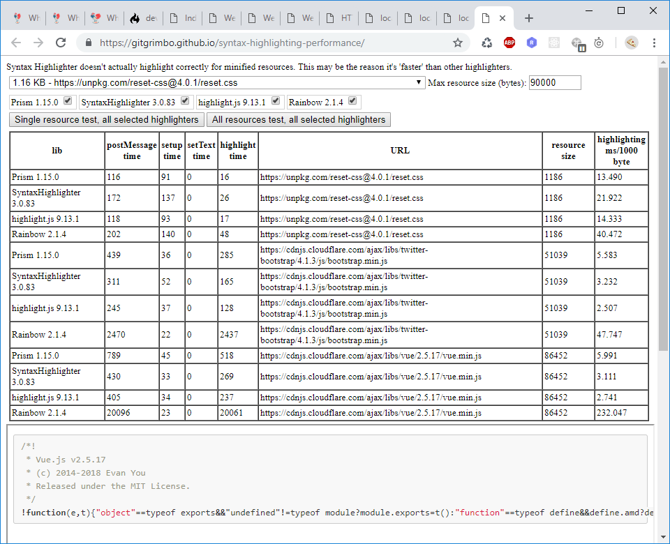

# syntax-highlighting-performance

Test harness to compare various run-in-the-browser syntax highlighters.

## Usage

- Enter a size cap (in bytes) as required, to limit the size of resources that are syntax highlighted.
- Check the syntax highlighters you want to test.
- Press one of the test buttons
  - Single resource test - to only highlight the selected resource (using all selected highlighters).
  - All resources test - to highlight all resources sequentially (using all selected highlighters).

## Results

- postMessage time - The entire 'round-trip' time of the main window asking the IFRAME to do the syntax highlighting, and receiving a response from the IFRAME after the syntax highlighting has taken place.
- setup time - The time taken to setup the IFRAME for a given syntax highlighter. E.g. add required JS/CSS to the IFRAME.
- setText time - The time taken to set the resource text in the DOM element to be syntax highlighted.
- highlight time - The time taken for the given syntax highlighter to do its highlighting.
